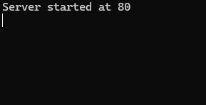
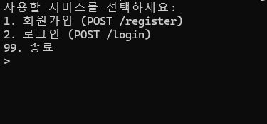
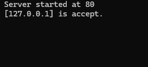
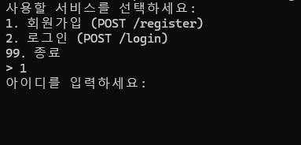
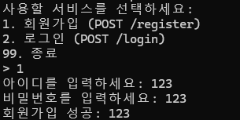
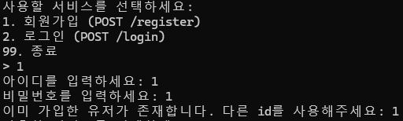
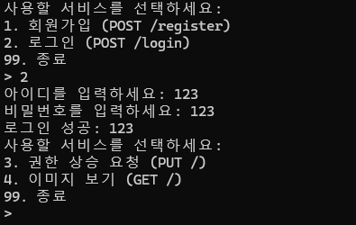
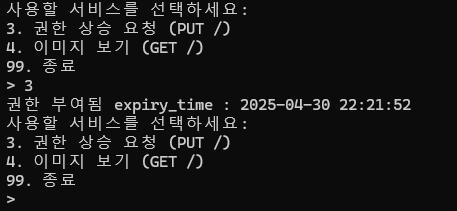

# *SocketProgram*
server.py는 `socket` 모듈을 사용하여 Python으로 구현된 간단한 HTTP 서버입니다. 사용자 등록, 로그인, 권한 상승, 이미지 다운로드 기능을 제공합니다.
## 요구 사항

- Python 3.x
- `pillow` 라이브러리 (이미지 처리용)

## 설치
이 저장소를 클론하고 프로젝트 디렉토리로 이동하세요:

```sh
$ git clone https://github.com/sihaun/SocketProgram.git
$ cd SocketProgram
$ pip install pillow
```

## 사용법
### 1. **서버 실행**
server 디렉터리로 이동한 후 포트 번호를 지정하여 서버를 실행하세요:

```sh
$ python server.py <port>
```

예시:

```sh
$ python server.py 80
```

이렇게 하면 서버가 `80` 포트에서 시작되며, 클라이언트의 요청을 대기합니다.
<p align="center">
    
</p>

---

### 2. **클라이언트 연결**

```sh
$ python client.py <host> <port>
```

예시:
```sh
$ python client.py www.server.com 80
```
client 디렉터리로 이동한 후 코드를 실행합니다. `<host>`에 서버의 IP 주소 또는 도메인을 입력하고, `<port>`에 서버 포트를 입력합니다.

연결에 성공하면 아래와 같은 화면이 나타납니다:
<p align="center">
    
</p>

server.py를 실행한 shell에서도 다음과 같은 출력이 나오면 정상적으로 연결된 것입니다:
<p align="center">
    
</p>

---

### 3. **회원가입**
서버를 이용하기 위해서는 회원가입을 진행해야합니다. 클라이언트 창으로 이동한 후 **1번(1. 회원가입)** 을 눌러주면 다음과 같은 화면이 출력됩니다:
<p align="center">
    
</p>
아이디와 비밀번호를 정상적으로 작성하면 다음과 같은 화면이 출력됩니다:
<p align="center">
    
</p>
중복된 사용자가 이미 존재할 경우 다음과 같은 에러 메세지가 출력됩니다:
<p align="center">
    
</p>

---

### 4. **로그인**
회원가입을 완료한 후 **2번(2. 로그안)** 을 눌러 로그인을 진행할 수 있습니다. 회원가입을 진행한 계정으로 로그인에 성공하면 다음과 같은 화면이 출력됩니다:
<p align="center">
    
</p>

---

### 5. **권한 상승 요청**
로그인에 성공한 후 이미지를 다운받아 보기 위해서는 권한을 상승해야 합니다. **3번(3. 권한 상승 요청)** 을 눌러 권한을 상승시키면 다음과 같은 화면이 출력됩니다:
<p align="center">
    
</p>
상승된 권한의 유효시간은 1시간입니다. 유효시간이 지났을 경우 권한을 다시 상승해야 이미지를 볼 수 있습니다.

---

### 6. **이미지 다운로드 요청**
권한 상승에 성공했다면 최종적으로 이미지를 다운받아 볼 수 있습니다. **4번(4. 이미지 보기)** 을 누른 후 **이미지 url(image.jpg)** 을 입력합니다. 서버에서 이미지 다운로드에 성공하였다면 아래 이미지가 출력됩니다:
<p align="center">
    
</p>
다운로드된 이미지는 web_cash 디렉터리에 저장됩니다. 추후 이미지 보기를 다시 요청할 경우 web_cash에 이미지가 있는지 확인한 후 존재할 경우 web_cash에서 이미지를 가져옵니다.

# server.py

## 기능
- JSON 데이터베이스(`users.json`)를 사용한 사용자 등록 및 인증
- 키 기반 인증을 통한 권한 상승
- 이미지 파일 검색 및 다운로드
- 멀티스레드 클라이언트 처리

## 사용법
포트 번호를 지정하여 서버를 실행하세요:

```sh
$ python server.py <port>
```

예시:

```sh
$ python server.py 80
```

이렇게 하면 서버가 `80` 포트에서 시작되며, 클라이언트의 요청을 대기합니다.

## 주요 클래스 및 함수

### 1. **`Server` 클래스**
`Server` 클래스는 `socket.socket`을 상속받아 서버 소켓의 동작을 정의합니다.

#### **`__init__(self, port: int)`**
- 서버 소켓을 초기화하고, 지정된 포트에서 클라이언트 연결을 대기합니다.
- **매개변수**: 
  - `port`: 서버가 바인딩할 포트 번호.
- **기능**:
  - 소켓 초기화 및 바인딩.
  - 클라이언트 연결 대기(`listen`).
  - 사용자 데이터베이스 접근을 위한 `threading.Lock` 생성.

#### **`__exit__(self, exc_type, exc_value, traceback)`**
- 서버 종료 시 호출됩니다.
- **기능**:
  - 예외 발생 시 로그 기록.
  - 소켓 닫기.

---

### 2. **HTTP 응답 생성 함수**

#### **`_create_response_str(self, status: str, headers: list = None, body: str = None) -> tuple`**
- 문자열 기반 HTTP 응답을 생성합니다.
- **매개변수**:
  - `status`: HTTP 상태 코드.
  - `headers`: 응답 헤더 리스트.
  - `body`: 응답 본문.
- **반환값**: `(response, None)` 형태의 튜플.

#### **`_create_response_byte(self, status: str, headers: list, body: bytes) -> tuple`**
- 바이트 기반 HTTP 응답을 생성합니다.
- **매개변수**:
  - `status`: HTTP 상태 코드.
  - `headers`: 응답 헤더 리스트.
  - `body`: 바이트 데이터.
- **반환값**: `(response, body)` 형태의 튜플.

---

### 3. **클라이언트 요청 처리**

#### **`client_handler(self, client_socket: socket.socket, addr) -> None`**
- 클라이언트와의 통신을 처리합니다.
- **매개변수**:
  - `client_socket`: 클라이언트와의 통신 소켓.
  - `addr`: 클라이언트 주소.
- **기능**:
  - 클라이언트 요청 수신 및 처리.
  - 응답 생성 후 클라이언트로 전송.

#### **`request_handler(self, request: str) -> tuple`**
- 클라이언트 요청을 분석하고 적절한 핸들러로 전달합니다.
- **매개변수**:
  - `request`: 클라이언트 요청 문자열.
- **기능**:
  - HTTP 메서드와 경로를 분석.
  - 요청 경로에 따라 적절한 핸들러 호출.
- **반환값**: 핸들러의 반환값.

---

### 4. **핸들러 함수**

#### **`register_handler(self, id: str, password: str) -> tuple`**
- 사용자 회원가입을 처리합니다.
- **매개변수**:
  - `id`: 등록할 사용자 ID.
  - `password`: 등록할 사용자 비밀번호.
- **기능**:
  - 사용자 데이터베이스에 ID와 비밀번호 저장.
  - 이미 존재하는 ID일 경우 에러 반환.

#### **`login_handler(self, id: str, password: str) -> tuple`**
- 사용자 로그인 요청을 처리합니다.
- **매개변수**:
  - `id`: 로그인할 사용자 ID.
  - `password`: 로그인할 사용자 비밀번호.
- **기능**:
  - 사용자 데이터베이스에서 ID와 비밀번호 확인.
  - 일치하면 성공 응답, 그렇지 않으면 실패 응답 반환.

#### **`privilege_handler(self, id: str, key_is_valid: bool = True) -> tuple`**
- 사용자 권한 상승 요청을 처리합니다.
- **매개변수**:
  - `id`: 사용자 ID.
  - `key_is_valid`: 키의 유효성 여부.
- **기능**:
  - 키가 유효하지 않으면 새 키를 발급.
  - 유효한 키가 이미 존재하면 에러 반환.

#### **`image_downloader(self, url: str) -> tuple`**
- 클라이언트가 요청한 이미지를 다운로드하여 반환합니다.
- **매개변수**:
  - `url`: 이미지 파일 경로.
- **기능**:
  - 파일이 존재하면 바이트 데이터를 반환.
  - 존재하지 않으면 404 응답 반환.

---

### 5. **유틸리티 함수**

#### **`load_users(self) -> dict`**
- 사용자 데이터베이스를 로드합니다.
- **반환값**: 사용자 데이터베이스 딕셔너리.

#### **`save_users(self, users: dict) -> None`**
- 사용자 데이터베이스를 저장합니다.
- **매개변수**:
  - `users`: 업데이트된 사용자 데이터베이스.

#### **`_is_valid_key(self, id: str) -> bool`**
- 사용자의 키가 유효한지 확인합니다.
- **매개변수**:
  - `id`: 사용자 ID.
- **반환값**: 키가 유효하면 `True`, 그렇지 않으면 `False`.

#### **`log_message(self, message)`**
- 서버 로그를 기록합니다.
- **매개변수**:
  - `message`: 로그 메시지.

---

### 6. **메인 함수**

#### **`main(port)`**
- 서버를 시작하고 클라이언트 연결을 처리합니다.
- **매개변수**:
  - `port`: 서버가 바인딩할 포트 번호.

#### **`if __name__ == "__main__":`**
- 명령줄 인자를 통해 포트를 받아 서버를 실행합니다.
- 클라이언트마다 새로운 스레드를 생성하여 요청을 처리합니다.

---

## 사용법
1. 서버 실행:
   ```sh
   $ python server.py <port>
   ```
   `<port>`에 원하는 포트 번호를 입력합니다.

2. 클라이언트 요청:
   - `/register`: 사용자 등록.
   - `/login`: 사용자 로그인.
   - `/privilege`: 권한 상승.
   - `/images`: 이미지 다운로드.

---

## 로그 파일
- 모든 서버 로그는 `server_log.txt`에 저장됩니다.

## 사용자 데이터베이스
- 사용자 정보는 `users.json` 파일에 저장됩니다.
## API 엔드포인트
### 1. 사용자 등록
**엔드포인트:** `POST /register`

**요청:**
```json
{
  "username": "사용자명",
  "password": "비밀번호"
}
```

**응답:**
- `200 OK`: 등록 성공
- `400 Bad Request`: 사용자 이미 존재함

### 2. 사용자 로그인
**엔드포인트:** `POST /login`

**요청:**
```json
{
  "username": "사용자명",
  "password": "비밀번호"
}
```

**응답:**
- `200 OK`: 로그인 성공
- `401 Unauthorized`: 잘못된 자격 증명

### 3. 권한 상승
**엔드포인트:** `POST /privilege`

**요청:**
```json
{
  "username": "사용자명"
}
```

**응답:**
- `200 OK`: 권한 상승 완료, 키 발급됨
- `409 Conflict`: 이미 권한 상승됨

### 4. 이미지 다운로드
**엔드포인트:** `POST /images`

**요청:**
```json
{
  "url": "이미지_파일_경로"
}
```

**응답:**
- `200 OK`: 바이너리 파일로 이미지 반환
- `404 Not Found`: 이미지 파일 없음

### 5. 이미지 키 유효성 검사
**엔드포인트:** `HEAD /images`

**요청:**
```json
{
  "username": "사용자명"
}
```

**응답:**
- `200 OK`: 키가 유효함
- `401 Unauthorized`: 키가 유효하지 않거나 만료됨

## 서버 설계
- 서버는 지정된 포트에서 요청을 대기하며, 클라이언트의 연결을 수락합니다.
- 각 클라이언트 요청은 별도의 스레드에서 처리되어 다중 접속을 지원합니다.
- 사용자 인증 데이터는 `users.json` 파일에 저장됩니다.
- 권한 상승은 1시간 동안 유효한 액세스 키를 사용하여 처리됩니다.
- 적절한 키가 제공되면 서버에서 이미지 파일을 제공합니다.

## 주의 사항
- `users.json` 파일이 존재하지 않는 경우, 서버가 요청을 처리할 때 자동으로 빈 JSON 파일을 생성합니다.
- 보안 강화를 위해 이 구현에는 암호화가 포함되어 있지 않습니다. 실제 운영 환경에서는 HTTPS를 사용하는 것이 좋습니다.

# client.py

## 기능

- 서버와의 HTTP 요청/응답 처리
- 회원가입 및 로그인
- 로그인 후 권한 상승 요청 가능
- 권한 상승 후 이미지 조회 가능
- 쿠키를 이용한 인증 유지

## 사용법

클라이언트를 실행하려면 서버의 IP와 포트를 지정하여 실행합니다.

```sh
$ python client.py <server_ip> <port>
```

예제:

```sh
$ python client.py 127.0.0.1 80
```

## 주요 클래스 및 함수

### 1. **`Client` 클래스**
`Client` 클래스는 `socket.socket`을 상속받아 클라이언트 소켓의 동작을 정의합니다.

#### **`__init__(self, host: str, port: int)`**
- 클라이언트 소켓을 초기화하고 서버에 연결합니다.
- **매개변수**:
  - `host`: 서버의 IP 주소 또는 도메인.
  - `port`: 서버의 포트 번호.
- **기능**:
  - 서버와 연결을 시도.
  - 세션 쿠키와 로그인 상태 초기화.

#### **`__exit__(self, exc_type, exc_value, traceback)`**
- 클라이언트 종료 시 호출됩니다.
- **기능**:
  - 세션 쿠키를 저장.
  - 소켓 닫기.

---

### 2. **HTTP 요청 및 응답 처리**

#### **`_send_request(self, request: str) -> None`**
- 서버로 HTTP 요청을 전송합니다.
- **매개변수**:
  - `request`: HTTP 요청 문자열.

#### **`_create_request(self, method: str, url: str, headers: list = None, body: str = None) -> str`**
- HTTP 요청을 생성합니다.
- **매개변수**:
  - `method`: HTTP 메서드 (GET, POST, PUT, HEAD).
  - `url`: 요청 경로.
  - `headers`: 요청 헤더 리스트.
  - `body`: 요청 본문.
- **기능**:
  - 세션 쿠키를 자동으로 추가.
  - 요청 문자열 생성.

#### **`_response_handler(self, bin_data: bool = False)`**
- 서버로부터 받은 응답을 처리합니다.
- **매개변수**:
  - `bin_data`: 응답 데이터가 바이너리인지 여부.
- **기능**:
  - 응답 헤더와 데이터를 분리.
  - 쿠키를 세션 쿠키에 저장.
- **반환값**:
  - 바이너리 데이터가 있으면 `(header, image_data)` 반환.
  - 없으면 응답 문자열 반환.

---

### 3. **클라이언트 기능**

#### **`register(self, username: str, password: str) -> None`**
- 회원가입 요청을 보냅니다. (POST /register)
- **매개변수**:
  - `username`: 사용자 ID.
  - `password`: 사용자 비밀번호.
- **기능**:
  - 서버에 회원가입 요청 전송.
  - 성공 시 쿠키 로드.

#### **`login(self, username: str, password: str) -> None`**
- 로그인 요청을 보냅니다. (POST /login)
- **매개변수**:
  - `username`: 사용자 ID.
  - `password`: 사용자 비밀번호.
- **기능**:
  - 서버에 로그인 요청 전송.
  - 성공 시 로그인 상태와 사용자 ID 저장.

#### **`upgrade_privilege(self) -> None`**
- 권한 상승 요청을 보냅니다. (PUT /privilege)
- **기능**:
  - 서버에 권한 상승 요청 전송.
  - 성공 시 세션 쿠키에 키와 만료 시간 저장.

#### **`show_image(self, url: str) -> None`**
- 이미지를 요청하고 표시합니다. (HEAD /images -> GET /images)
- **매개변수**:
  - `url`: 이미지 파일 경로.
- **기능**:
  - 권한 확인 후 이미지 요청.
  - 이미지를 다운로드하여 표시하고 로컬에 저장.

---

### 4. **유틸리티 함수**

#### **`_is_domain(self, host: str) -> bool`**
- 입력된 호스트가 도메인인지 확인합니다.
- **매개변수**:
  - `host`: IP 주소 또는 도메인.
- **반환값**: 도메인이면 `True`, 아니면 `False`.

#### **`domain_to_ip(self, host: str) -> str`**
- 도메인을 IP 주소로 변환합니다.
- **매개변수**:
  - `host`: IP 주소 또는 도메인.
- **반환값**: IP 주소.

#### **`load_cookies(self) -> None`**
- 쿠키 데이터를 로드합니다.
- **기능**:
  - `cookies.json` 파일에서 세션 쿠키를 읽어옵니다.

#### **`save_cookies(self, session_cookies: dict) -> None`**
- 쿠키 데이터를 저장합니다.
- **매개변수**:
  - `session_cookies`: 세션 쿠키 딕셔너리.
- **기능**:
  - 세션 쿠키를 `cookies.json` 파일에 저장.

---

### 5. **메인 함수**

#### **`main(host: str, port: int)`**
- 클라이언트의 주요 기능을 실행합니다.
- **매개변수**:
  - `host`: 서버의 IP 주소 또는 도메인.
  - `port`: 서버의 포트 번호.
- **기능**:
  - 회원가입, 로그인, 권한 상승, 이미지 보기 기능 제공.
  - 사용자 입력에 따라 적절한 기능 실행.

#### **`if __name__ == "__main__":`**
- 명령줄 인자를 통해 서버의 호스트와 포트를 받아 클라이언트를 실행합니다.

---

## 사용법
1. 클라이언트 실행:
   ```sh
   $ python client.py <host> <port>
   ```
   `<host>`에 서버의 IP 주소 또는 도메인을 입력하고, `<port>`에 서버 포트를 입력합니다.

2. 주요 기능:
   - **회원가입**: POST /register
   - **로그인**: POST /login
   - **권한 상승 요청**: PUT /privilege
   - **이미지 보기**: GET /images

---

## 쿠키 파일
- 세션 쿠키는 `cookies.json` 파일에 저장됩니다.

## 이미지 캐시
- 다운로드된 이미지는 `web_cash/` 디렉토리에 저장됩니다.
## API 사용 방법

### 1. 회원가입 (POST /register)
- 사용자가 회원가입할 수 있습니다.

**요청 데이터:**  
```json
{
  "username": "사용자명",
  "password": "비밀번호"
}
```

**응답:**  
- `REGISTER_SUCCESS` : 회원가입 성공  
- `User already exists` : 이미 존재하는 사용자  

### 2. 로그인 (POST /login)
- 로그인하면 쿠키가 저장됩니다.

**요청 데이터:**  
```json
{
  "username": "사용자명",
  "password": "비밀번호"
}
```

**응답:**  
- `LOGIN_SUCCESS` : 로그인 성공  
- `LOGIN_FAILED` : 로그인 실패  

### 3. 권한 상승 (PUT /privilege)
- 로그인 후 권한을 상승시킬 수 있습니다.

**요청 데이터:**  
```json
{
  "username": "사용자명"
}
```

**응답:**  
- `PRIVILEGE_CHANGED` : 권한 상승 완료  
- `PRIVILEGE_ALREADY_CHANGED` : 이미 권한이 상승됨  

### 4. 이미지 조회 (GET /images)
- 권한 상승 후 서버에서 이미지를 받아올 수 있습니다.

**요청 데이터:**  
```json
{
  "url": "이미지_파일_경로"
}
```

**응답:**  
- `200 OK` : 이미지 반환  
- `404 Not Found` : 이미지 없음  

## 주의 사항

- `cookies.json` 파일이 클라이언트 인증을 위해 사용됩니다.
- `web_cash` 폴더에 다운로드된 이미지가 저장됩니다.
- 도메인 사용 시 `SERVER_IP` 값을 사전에 설정해야 합니다.
